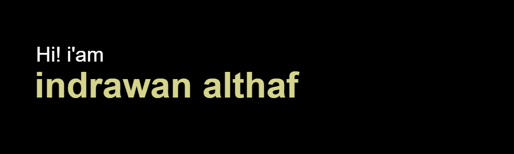

<h3 align="center">Saya seorang mahasiswa dari Politeknik Negeri Batam jurusan Teknik Rekayasa Multimedia, saya memiliki minat di bidang teknologi terutama bagian media. Saya memiliki keterampilan dalam Web Development,IoT,perbaikan komputer, dan desain. Saya bersemangat dalam menciptakan pengalaman Tekonolgi yang menarik dan fungsional. Kemampuan pemrograman dan desain saya memungkinkan saya untuk menghadirkan solusi inovatif. Saya selalu mencari tantangan baru di dunia IT yang selalu berubah.  Mari kita terhubung dan berkolaborasi untuk menciptakan hal-hal hebat.</h3>

###

  
  

###

###

  
  
  
  
  
  
  
  
  
  
  
  
  
  
  
  
  
  
  

###

  
  
  
  

###

